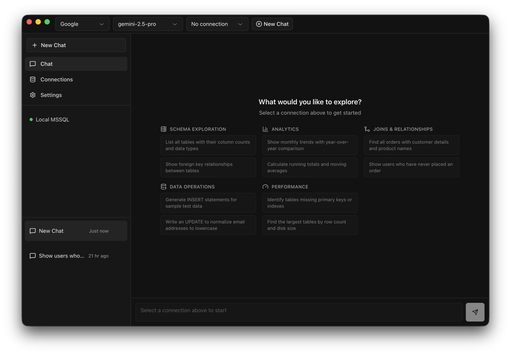

<div align="center">

# SQL Assist

**Turn natural language into SQL.**

[](LICENSE)
[](https://nodejs.org)
[](https://github.com/mrgodhani/sql-assistant-desktop/releases/latest)
[](https://github.com/mrgodhani/sql-assistant-desktop/releases/latest)

[**⬇ Download for macOS**](https://github.com/mrgodhani/sql-assistant-desktop/releases/latest) · [Landing Page](https://meetgodhani.github.io/sql-assistant-desktop/) · [Contributing](CONTRIBUTING.md)

---



Connect to your database, ask questions in plain English, and get accurate queries powered by AI. Execute, visualize, and export — all from a native desktop app.

</div>

---

## Why SQL Assist?

| | |
|---|---|
| 🗣 **No SQL expertise required** | Describe what you need, get working queries |
| 🔒 **Your schema, your data** | AI sees your tables and relationships for accurate results |
| 🌐 **Works offline** | Use local Ollama or connect to cloud AI providers |
| ⚡ **One app for everything** | Query, chart, and export without leaving your workflow |

## Features

| Feature | Description |
|---|---|
| 🗄️ **Multi-database** | PostgreSQL, MySQL, SQLite, SQL Server |
| 🤖 **AI providers** | OpenAI, Anthropic, Google, OpenRouter, or local Ollama |
| 🧠 **Schema-aware** | AI receives your schema for context-accurate queries |
| 🔍 **Schema search** | Fuzzy search across tables and columns (`Cmd+K`) |
| 📋 **EXPLAIN visualizer** | Run EXPLAIN on queries, view plans as Mermaid diagrams |
| ⚡ **Query optimization** | Get index and rewrite suggestions from AI |
| 📊 **Results** | Sortable, filterable tables with virtual scrolling |
| 📈 **Charts** | Bar, line, pie, scatter, area — from any result set |
| 📤 **Export** | Excel, CSV, and branded Reports (headers, footers, logo, chart) |
| 💬 **Conversations** | Chat history saved locally |

## Quick Start

```bash
git clone https://github.com/meetgodhani/sql-assist-desktop.git
cd sql-assist-desktop
npm install
npm run dev
```

**Prerequisites:** Node.js 18+

## Supported Databases & AI Providers

**Databases:**
`PostgreSQL` · `MySQL` · `SQLite` · `SQL Server`

**AI Providers:**
`OpenAI` · `Anthropic` · `Google` · `OpenRouter` · `Ollama (local)`

## Building

```bash
npm run build
```

See [CONTRIBUTING.md](CONTRIBUTING.md) for macOS code signing, notarization setup, and release workflow details.

## Project Structure

```text
src/
├── main/      # Electron main process (services, IPC, database)
├── preload/   # Preload scripts (contextBridge APIs)
├── renderer/  # Vue 3 frontend (components, stores, views)
└── shared/    # Shared types and constants
```

## Contributing

Contributions are welcome. See [CONTRIBUTING.md](CONTRIBUTING.md) for setup, code style, and how to submit a pull request.

## License

[MIT](LICENSE) © meetgodhani
