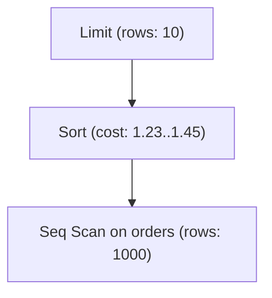

# Query Intelligence Feature — Design Document

**Date:** 2025-03-11  
**Approach:** A — Query Intelligence (differentiation from AI SQL tools, traditional DB GUIs, and general AI chat)

---

## 1. Overview & Scope

Three features:

1. **EXPLAIN visualizer** — Run EXPLAIN/EXPLAIN ANALYZE on a query and show the plan as a Mermaid flowchart instead of raw text.
2. **AI query optimization** — "Optimize this query" in chat; AI suggests indexes, rewrites, and explains trade-offs.
3. **Schema search** — Fuzzy search across tables and columns, with optional AI suggestions.

**Scope:** All three require an active connection. EXPLAIN and schema search are local-only (no AI). AI optimization uses existing chat flow and providers.

**Implementation order:** Schema search first (reusable for AI optimization), then EXPLAIN visualizer, then AI optimization.

---

## 2. EXPLAIN Visualizer

**Entry point:** Button/action on each SQL block in chat (e.g. "Explain plan") that runs EXPLAIN on that query and shows the plan in a visual panel.

**Database support:**

| Database   | Command                    | Output format                          |
|-----------|----------------------------|----------------------------------------|
| PostgreSQL| `EXPLAIN (FORMAT TEXT)` or `EXPLAIN (FORMAT JSON)` | Text or JSON (JSON preferred for parsing) |
| MySQL     | `EXPLAIN FORMAT=JSON`       | JSON                                   |
| SQLite    | `EXPLAIN QUERY PLAN`       | Text only (no JSON)                     |
| SQL Server| `SET SHOWPLAN_XML ON` + query | XML                                    |

**Visualization:** Use **Mermaid** to render the plan as a flowchart/tree.

- Flowchart syntax (`flowchart TB`): each plan node becomes a Mermaid node; parent→child edges represent the plan tree.
- Node content: operation type (Seq Scan, Index Scan, Hash Join, etc.), table name when relevant, cost/row estimates.
- Add `mermaid` package; render the generated diagram in the EXPLAIN panel.

**Example Mermaid output:**

**UI:** Collapsible panel below the SQL block. Tabs for "Tree" (Mermaid) and "Raw" (original EXPLAIN text). Loading state while the explain query runs.

**Safety:** Reuse existing destructive-statement checks. EXPLAIN is read-only.

**Phasing:** PostgreSQL and MySQL first (JSON). SQLite (text parser) and SQL Server (later).

---

## 3. AI Query Optimization

**Entry point:** Button/action on each SQL block (e.g. "Optimize") that sends the query to the AI with a dedicated optimization prompt.

**Flow:**
1. User clicks "Optimize" on a SQL block.
2. App sends the query + schema context + dialect to the AI with an optimization-focused system prompt.
3. AI returns suggestions: index recommendations, query rewrites, brief explanations.
4. Response is shown in chat (or a side panel) as markdown with code blocks.

**System prompt:** Extend or add a variant that instructs the AI to suggest indexes, propose rewrites, explain trade-offs, and keep suggestions dialect-specific.

**Integration:** Add a dedicated `optimizeQuery` API (non-streaming). Keeps optimization separate from chat history.

**UI:** "Optimize" button on each SQL block. On click, show loading state, then render the AI response in a collapsible section below the SQL.

---

## 4. Schema Search

**Entry point:** Command palette (e.g. `Cmd+K` / `Ctrl+K`) that opens a search modal.

**Scope:** Search over cached schema: table names, column names, optionally column types. Results show table → column hierarchy.

**Behavior:**
- Fuzzy search: partial matches (e.g. "cust" → `customer_id`, `customers`, `customer_name`).
- Results grouped by table, with columns listed under each table.
- Clicking a result inserts the table/column reference into the chat input or copies it.

**Data source:** `schemaService.getCachedSchema(connectionId)`. If cache is empty, trigger introspection first.

**UI:** Command palette (`Cmd+K`). Keeps main UI clean; extensible for future commands.

---

## 5. Architecture, Data Flow & Error Handling

**Architecture**

| Layer | Responsibility |
|-------|----------------|
| Main process | New `explain.service.ts` (EXPLAIN execution, dialect-specific wrapping, JSON/text parsing). Extend `ai.service.ts` with `optimizeQuery()`. Schema search uses existing `schema.service.ts`. |
| IPC | New handlers: `explain:run`, `ai:optimizeQuery`. Optional `schema:search` if server-side fuzzy search. |
| Preload | Expose `explainApi.run()`, `aiApi.optimizeQuery()`, schema search API. |
| Renderer | New components: `ExplainPanel.vue` (Mermaid + raw tabs), `SchemaSearchCommand.vue` (command palette). Extend `SqlCodeBlock.vue` with "Explain" and "Optimize" actions. |

**Data flow**

1. **EXPLAIN:** User clicks "Explain" → `SqlCodeBlock` calls `explainApi.run(connectionId, sql)` → main runs dialect-specific EXPLAIN → parses result → returns structured plan + raw text → renderer converts to Mermaid and renders.
2. **Optimize:** User clicks "Optimize" → `SqlCodeBlock` calls `aiApi.optimizeQuery(connectionId, sql)` → main gets schema + dialect, builds optimization prompt, calls AI (non-streaming) → returns markdown → renderer displays.
3. **Schema search:** User opens palette (`Cmd+K`) → `SchemaSearchCommand` gets cached schema → fuzzy search in renderer → user selects → inserts/copies to input.

**Error handling**

| Scenario | Behavior |
|----------|----------|
| No connection | Disable Explain/Optimize; schema search shows "Connect to a database first". |
| Connection lost during EXPLAIN | Show "Connection lost. Please reconnect." |
| EXPLAIN fails | Show sanitized DB error; keep raw output if partially returned. |
| AI optimize fails | Reuse existing `AIServiceError` handling; show retry when retryable. |
| Schema cache empty | Trigger introspection before search; show loading state. |
| Mermaid parse/render fails | Fall back to raw text tab; log. |

**Database support matrix**

| Feature | PostgreSQL | MySQL | SQLite | SQL Server |
|---------|------------|-------|--------|------------|
| EXPLAIN (Mermaid) | ✅ JSON | ✅ JSON | ⚠️ Text parser | ⏳ Later |
| AI Optimize | ✅ | ✅ | ✅ | ✅ |
| Schema Search | ✅ | ✅ | ✅ | ✅ |

---

## 6. Testing

**Unit tests:** EXPLAIN parser (PostgreSQL/MySQL/SQLite → Mermaid), AI optimization prompt builder, schema search fuzzy logic, explain service dialect wrappers.

**Integration tests:** `explainApi.run()` with mocked connection, `aiApi.optimizeQuery()` response shape.

**E2E / manual:** Explain button → Mermaid panel; Optimize button → AI response; `Cmd+K` → schema search opens.

**Patterns:** Vitest, `@vue/test-utils`, existing database service mocking.
